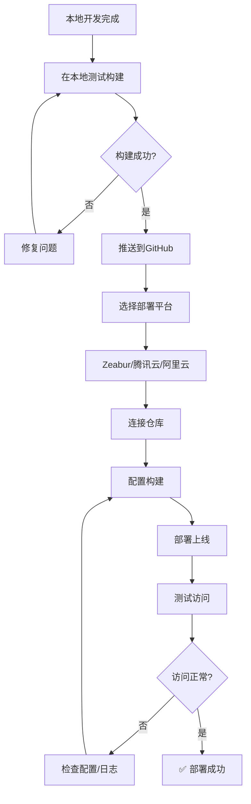

# 🚀 应用部署指南

本文档提供多个国内可访问的部署平台方案，帮助您快速将应用部署上线。

---

## 📋 目录

- [平台对比](#平台对比)
- [方案一：Zeabur（推荐）](#方案一zeabur推荐)
- [方案二：腾讯云 CloudBase](#方案二腾讯云-cloudbase)
- [方案三：阿里云开发平台](#方案三阿里云开发平台)
- [方案四：Cloudflare Pages](#方案四cloudflare-pages)
- [部署前准备](#部署前准备)
- [常见问题](#常见问题)

---

## 🔍 平台对比

| 平台 | 国内访问 | 免费额度 | 易用性 | GitHub集成 | 推荐指数 |
|------|---------|---------|--------|-----------|---------|
| **Zeabur** | ⭐⭐⭐⭐⭐ | 良好 | 极简 | ✅ | ⭐⭐⭐⭐⭐ |
| **腾讯云CloudBase** | ⭐⭐⭐⭐⭐ | 丰富 | 简单 | ✅ | ⭐⭐⭐⭐ |
| **阿里云** | ⭐⭐⭐⭐⭐ | 一般 | 中等 | ✅ | ⭐⭐⭐⭐ |
| **Cloudflare Pages** | ⭐⭐⭐ | 优秀 | 简单 | ✅ | ⭐⭐⭐ |

---

## 方案一：Zeabur（推荐）

### ✨ 为什么选择 Zeabur？

- 🇨🇳 **国内访问稳定**：部署平台和生成的网站均可在国内流畅访问
- 🎯 **体验接近Vercel**：界面简洁，操作流程几乎一致
- 🚀 **自动化部署**：Git推送即自动构建部署
- 💰 **免费额度充足**：个人项目完全够用
- 📚 **中文文档完善**：学习曲线低

### 📝 部署步骤

#### 1. 注册账号

访问 [Zeabur官网](https://zeabur.com)，使用GitHub账号登录（推荐）

#### 2. 创建新项目

```
点击 "Create Project" → 选择 "Deploy New Service" → "Git"
```

#### 3. 连接GitHub仓库

- 授权Zeabur访问您的GitHub
- 选择要部署的仓库
- Zeabur会自动检测项目类型（Vite/React/Next.js等）

#### 4. 配置构建设置（通常自动检测）

如需手动配置：

```yaml
# 构建命令
npm run build

# 输出目录
dist

# 安装命令
npm install
```

#### 5. 部署

点击 "Deploy" 按钮，等待构建完成（通常1-3分钟）

#### 6. 访问网站

部署成功后，Zeabur会分配一个域名：
```
your-project.zeabur.app
```

### 🎛️ 高级配置

#### 环境变量设置

在项目设置中添加环境变量：

```
Settings → Environment Variables → Add Variable
```

示例：
```
VITE_API_URL=https://api.example.com
VITE_APP_TITLE=My Application
```

#### 自定义域名

```
Domains → Add Domain → 输入您的域名
```

按照提示配置DNS解析即可。

---

## 方案二：腾讯云 CloudBase

### ✨ 平台优势

- 🏢 **腾讯官方产品**，稳定可靠
- 🌐 **国内CDN加速**，访问速度快
- 💎 **免费额度丰富**，适合中小型项目
- 🔧 **功能完整**，支持云函数、数据库等

### 📝 部署步骤

#### 1. 准备工作

访问 [腾讯云Webify](https://cloud.tencent.com/product/webify)，注册并实名认证

#### 2. 安装CLI（可选）

```bash
npm install -g @cloudbase/cli
```

#### 3. 通过控制台部署

1. 登录腾讯云控制台
2. 进入 **Webify** 服务
3. 点击 **新建应用**
4. 选择 **导入已有仓库**
5. 授权并选择GitHub仓库

#### 4. 配置构建

```yaml
# 框架检测：Vite
# 构建命令：npm run build
# 发布目录：dist
# Node版本：18.x（推荐）
```

#### 5. 部署

点击 **立即部署**，等待构建完成

#### 6. 访问

系统会分配一个腾讯云域名：
```
your-project.tcloudbaseapp.com
```

### 🔧 配置环境变量

在 **应用设置 → 环境变量** 中添加：

```
VITE_API_URL=https://api.example.com
```

---

## 方案三：阿里云开发平台

### ✨ 平台优势

- 🏢 阿里云生态，企业级稳定性
- 🌐 强大的CDN网络
- 🔐 完善的安全措施

### 📝 部署步骤

#### 1. 访问平台

[阿里云云开发平台](https://workbench.aliyun.com)

#### 2. 创建应用

1. 登录后点击 **新建应用**
2. 选择 **前端应用**
3. 导入GitHub仓库

#### 3. 配置构建

```yaml
构建命令：npm run build
输出目录：dist
Node版本：建议选择 18.x
```

#### 4. 部署并发布

点击部署，等待构建完成后即可访问

---

## 方案四：Cloudflare Pages

### ✨ 平台特点

- 🌍 **全球CDN**，速度快
- 💰 **完全免费**，无限流量
- ⚠️ **国内访问不稳定**（偶尔需要科学上网）

### 📝 部署步骤

#### 1. 注册

访问 [Cloudflare Pages](https://pages.cloudflare.com)

#### 2. 连接GitHub

点击 **Create a project → Connect to Git**

#### 3. 配置项目

```yaml
Framework preset: Vite
Build command: npm run build
Build output directory: dist
```

#### 4. 部署

点击 **Save and Deploy**

#### 5. 访问

分配域名格式：
```
your-project.pages.dev
```

---

## 🔧 部署前准备

### 1. 检查 `package.json`

确保build脚本正确：

```json
{
  "scripts": {
    "dev": "vite",
    "build": "vite build",
    "preview": "vite preview"
  }
}
```

### 2. 环境变量处理

创建 `.env.example` 文件，列出所需环境变量：

```bash
# .env.example
VITE_API_URL=
VITE_APP_TITLE=
```

> ⚠️ **注意**：不要将 `.env` 文件提交到Git

### 3. 配置 `.gitignore`

确保以下内容被忽略：

```
# .gitignore
node_modules
dist
.env
.env.local
```

### 4. 优化构建

在 `vite.config.ts` 中添加优化配置：

```typescript
import { defineConfig } from 'vite'
import react from '@vitejs/plugin-react'

export default defineConfig({
  plugins: [react()],
  build: {
    outDir: 'dist',
    sourcemap: false,
    minify: 'terser',
    rollupOptions: {
      output: {
        manualChunks: {
          vendor: ['react', 'react-dom']
        }
      }
    }
  }
})
```

### 5. 本地测试构建

部署前务必测试：

```bash
# 构建
npm run build

# 预览
npm run preview
```

访问 `http://localhost:4173` 检查是否正常

---

## 🔍 常见问题

### Q1: 部署后页面空白？

**原因**：路由配置问题

**解决方案**：

在项目根目录创建 `vercel.json` 或对应平台的配置文件：

```json
{
  "rewrites": [
    { "source": "/(.*)", "destination": "/index.html" }
  ]
}
```

对于Zeabur，在 `zeabur.toml` 中：

```toml
[routes]
"/*" = "/index.html"
```

### Q2: 环境变量不生效？

**检查清单**：
- ✅ 变量名是否以 `VITE_` 开头
- ✅ 是否在部署平台配置了环境变量
- ✅ 重新构建部署

### Q3: 构建失败？

**常见原因**：
1. Node版本不匹配 → 在部署配置中指定Node 18.x
2. 依赖安装失败 → 检查 `package.json` 是否正确
3. 内存不足 → 减少构建并发或优化代码

### Q4: 国内访问慢？

**优化方案**：
1. 使用国内平台（Zeabur、腾讯云）
2. 配置CDN加速
3. 启用Gzip/Brotli压缩
4. 优化图片和资源加载

### Q5: 如何实现自动部署？

所有推荐平台都支持Git自动部署：

```
推送代码到GitHub → 自动触发构建 → 自动部署上线
```

---

## 🎯 推荐部署流程



---

## 📞 获取帮助

- **Zeabur文档**: https://zeabur.com/docs
- **腾讯云文档**: https://cloud.tencent.com/document/product/1243
- **Cloudflare文档**: https://developers.cloudflare.com/pages

---

## 🎉 快速开始建议

**如果您是第一次部署，建议按以下顺序尝试：**

1. ⭐ **首选：Zeabur** - 最简单，国内访问最稳定
2. 🏢 **备选：腾讯云** - 免费额度大，功能丰富
3. 🌍 **国际方案：Cloudflare Pages** - 完全免费，速度快（需科学上网）

**祝您部署顺利！🚀**
